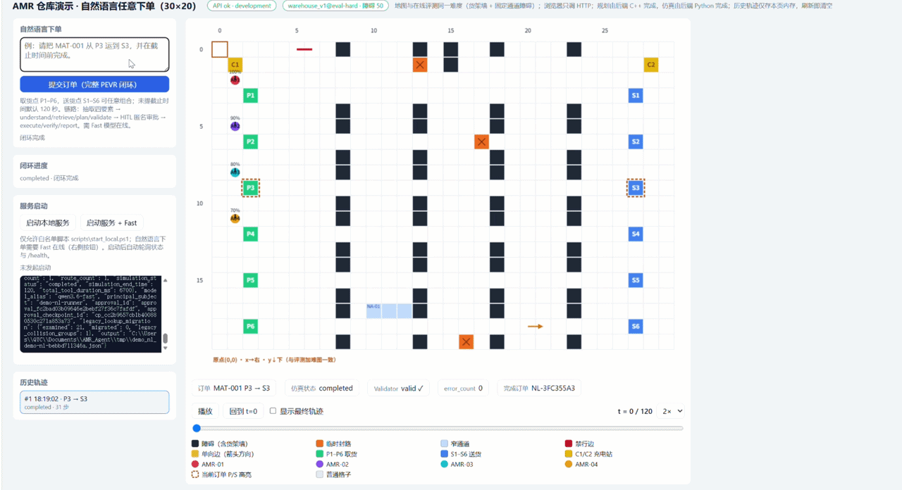
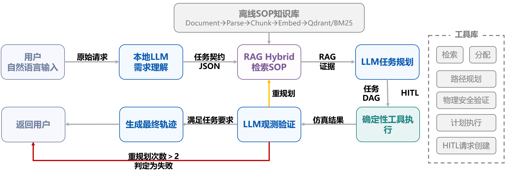

# Verified AMR Agent

面向仓储 AMR 车队的本地、受控、可验证 Agent 系统。大模型只负责理解与规划，任务分配、路径规划、计划验证与仿真全部由确定性 Python/C++ 代码完成。



## 核心闭环

```text
自然语言目标
  → 受限上下文与结构化任务合同
  → RAG 证据
  → 任务 DAG
  → 确定性分配/路径/验证
  → 离散事件仿真
  → 观测验证与局部重规划/审批
  → 带引用的证据报告
```



## 功能特性

- **自然语言下单**：本地 Qwen 3.6 35B A3B 模型把任意运输请求抽取为结构化订单；演示链即抽即走，正式链进入完整 PEVR 闭环。
- **固定八阶段 PEVR 闭环**：`guard → understand → retrieve → plan → validate → execute → verify → finish`；任何计划必须先通过确定性 Validator 才能执行。
- **C++17 确定性规划**：A* 路径规划、车队计划独立验证器，严格 JSON stdin/stdout 边界。
- **Python 离散事件仿真**：固定 1 秒 tick，只执行通过验证的计划；覆盖充电、工位容量与 Eval 专用故障注入。
- **RAG 证据与拒答**：章节切块、本地 Embedding + Qdrant/BM25 混合检索、检索期 ACL、引用标注与证据不足确定性拒答。
- **安全与人工接管**：HITL 审批、九个白名单工具。
- **可恢复执行**：Checkpoint + Effect Ledger 幂等、故障分类与局部重规划、Token/步数/时长硬预算。
- **可观测与评测**：全链路 Trace、受控验证报告、固定 60 例评测与 Workflow/ReAct/PEVR 三策略对照。
- **演示 Web 页面**：仓库地图可视化、自然语言任意下单、轨迹回放、内存历史轨迹、一键启动本地服务。
- **本地部署**：Docker Compose（API/PostgreSQL/Qdrant）+ 宿主机本地模型脚本

## 快速开始

```powershell
# 安装锁定依赖
python -m pip install -r .\requirements.lock -r .\requirements-dev.lock

# 一键启动 API + PostgreSQL + Qdrant（需要 Docker Desktop）
.\scripts\start_local.ps1

# 启动本地 Fast 模型
.\scripts\start_local.ps1 -StartFast
```

启动后打开演示页 `http://127.0.0.1:8000/demo`：输入自然语言订单即可看到规划结果与轨迹回放。

统一回归（pytest + CTest）：

```powershell
.\scripts\run_smoke.ps1
```

## 文档导航

| 文档 | 内容 |
|---|---|
| [docs/PROJECT_OVERVIEW.md](docs/PROJECT_OVERVIEW.md) | 项目完整说明：固定范围、工作包状态、架构与各子系统细节 |
| [docs/ARCHITECTURE.md](docs/ARCHITECTURE.md) | 系统架构图与数据流 |
| [docs/API.md](docs/API.md) | HTTP 接口契约 |
| [docs/SERVICES_STARTUP.md](docs/SERVICES_STARTUP.md) | 服务启动手册 |
| [docs/TEST_REPORT.md](docs/TEST_REPORT.md) | 测试与验证报告 |
| [docs/HANDOFF_CONTEXT.md](docs/HANDOFF_CONTEXT.md) | 跨会话交接上下文 |
| [docs/FILE_PURPOSES.md](docs/FILE_PURPOSES.md) | 文件职责登记表 |
