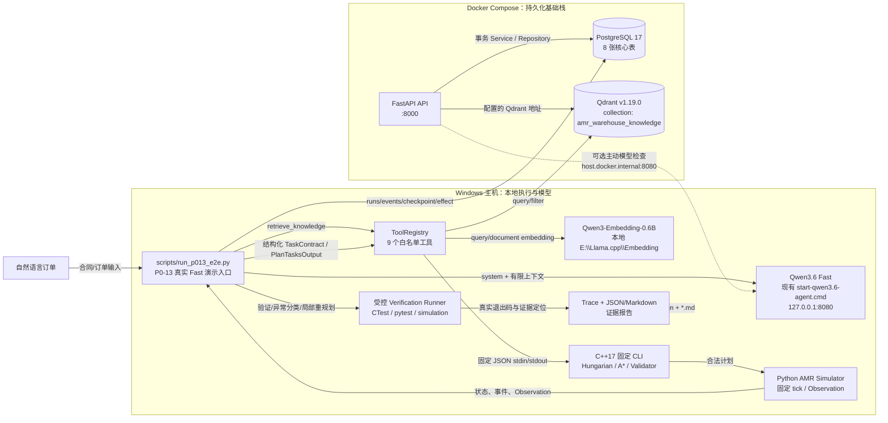

# AMR Agent P0 系统架构

本文档是 P0-20 的静态架构图和数据流说明。图中把 Docker Compose 内的 API、PostgreSQL、Qdrant 与 Windows 主机上的 Fast 模型、C++/Python 执行链分开，避免把本地模型误写成容器服务或远程依赖。

## 1. 端到端数据流

## 2. 边界与职责

| 边界 | 负责内容 | 明确不做 |
|---|---|---|
| FastAPI/API | JWT/RBAC、运行/计划/事件/审批/文档/评测运行持久化接口，轻量健康检查 | 不把自然语言直接变成未验证底盘指令；API 的 `/evals/runs` 只登记评测运行 |
| Qdrant + 本地 Embedding | 冻结 SOP 的向量召回、ACL 过滤和引用候选 | 不依赖远程 Embedding；P0 不实现 Reranker |
| Model Gateway | Fast alias 门禁、结构化输出、超时和一次 Schema 修复 | 不暴露 GGUF、Shell、文件或模型内置工具 |
| Tool Registry | 九个固定工具的 Schema、角色、超时、错误、审计和幂等边界 | 不接受 executable、command、script、SQL、Shell、URL 或 `faults` 参数 |
| C++17 | Hungarian 分配、A* 时空预约、独立 Fleet Validator | 不读取 `environment_ref` 指向的任意文件；不信任 LLM 的“已验证”字段 |
| Python 仿真/验证 | 固定 tick 执行、Observation、故障注入评测、受控 CTest/pytest/仿真报告 | 不接真实 ROS/底盘；故障注入不进入正常 Agent 工具清单 |
| PostgreSQL | runs、plans、tasks、tool_calls、effects、approvals、events、documents 及恢复证据 | 不由 API 启动时自动删表；迁移只有向前升级 |

## 3. 真实演示入口

P0-20 的 3 分钟演示使用 Windows 主机上的 `scripts/run_p013_e2e.py`，因为该入口能够在同一进程内串起 Fast 模型、RAG、DAG、固定 C++ CLI、仿真、验证和 Trace 报告。Compose API 用于同时提供持久化与 HTTP 健康/审批边界，不会把 Fast 模型复制进容器。

演示和评测的完整命令见 [SERVICES_STARTUP.md](SERVICES_STARTUP.md)、[API.md](API.md) 与 [DEMO_SCRIPT.md](DEMO_SCRIPT.md)。

## 4. 证据落点

| 证据 | 位置 |
|---|---|
| 数据库状态与恢复 | PostgreSQL `runs/plans/tasks/tool_calls/effects/approvals/events/documents` |
| RAG 证据 | Qdrant `amr_warehouse_knowledge` payload 中的 chunk/source/section/version/citation |
| C++ 结果 | ToolResult 的 output digest、Validator evidence 与 Trace tool event |
| 仿真结果 | SimulationResult、SimulationEvent、Observation 与 evidence refs |
| 评测结果 | `tmp/p018_eval_final/`、`tmp/p019_strategy_compare/`（自动生成物，不是源码交付） |
| 真实在线闭环 | PostgreSQL 中三个正式 Fast run_id（见 `docs/TEST_REPORT.md`）及 P0-20 交接记录 |
